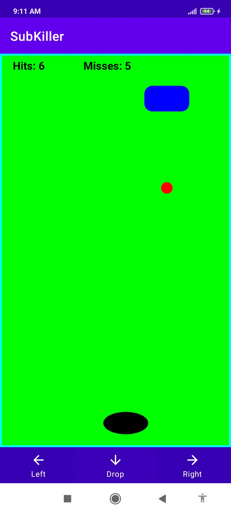

## Pre-requisites

Install android studio and the sdk.

## Instructions

These application can run on any android device with version of andorid 5+

## A view of the app

## More information

This app is inspired by the example in the textbook:

https://math.hws.edu/javanotes/c6/s3.html

